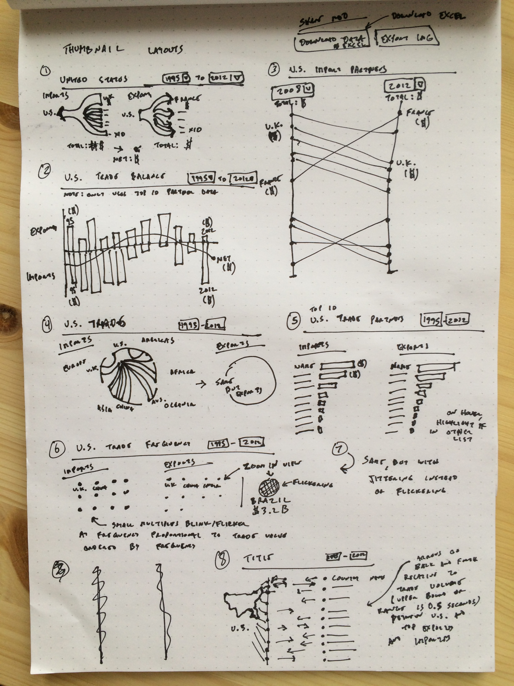
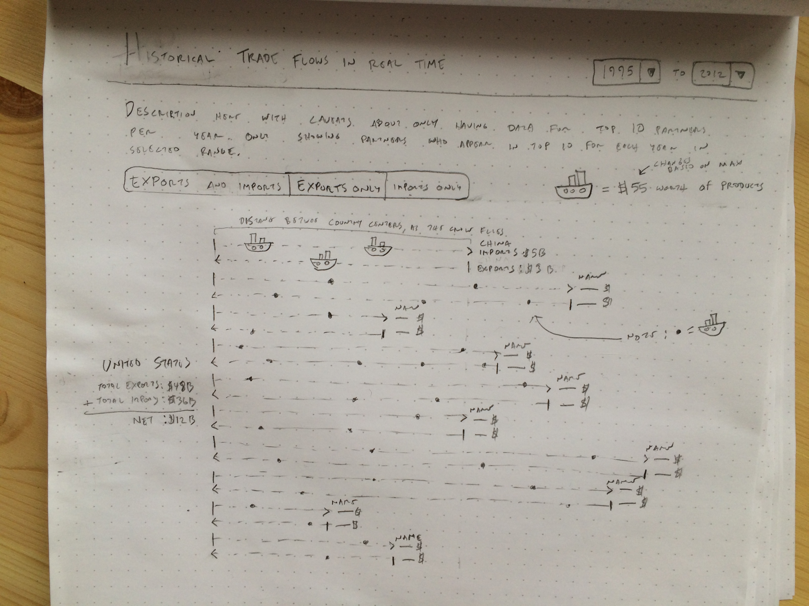

# CS 171 Design Studio 1 Answers
### PART 1 - ANALYSIS
Users who would be interested in this dataset:
* economics student
* high school social studies student
* international investor
* government analysts/researchers (in the U.S. at, say, the State Department or USITC), minister of finance or industry commerce
* logistics researcher at shipping corporation
* general public (given a news hook)

#### Chosen user
High school social studies student

#### User story
Alvaro Gomez is a 11th grader in Ms. Miller’s AP U.S. History class. The year is 2013. For his final assignment, he’s has to write a two-page report on the United State’s economy since the 2008 recession, as well as provide two graphs that support his findings and describe what they show. From Wikipedia, Alvaro has stats for 2012, but he doesn’t know where to find straightforward information about the 2008-2012 period.

#### Tasks
Learn who the United States exported and imported from the most in 2012 (discover)
Learn whether those trade partners are the same as they were in 2008 (discover)
Learn what products make up the bulk of the United States’ imports and exports in 2012 (discover)
Learn whether the United States has a positive or negative trade balance and how that’s changed from 2008 to 2014 (discover)
Export the graphs as images (present)
Download the data for the graphs (present, kind of)

### PART 2 - SKETCHING

### PART 3 - REFLECTION
_I'm an OED student, so I couldn't workshop my ideas with other students. Instead, I’ve written about why I’ve decided to build the frequency graph._

I chose Alvaro, the high school student, because the provided dataset doesn’t go deep enough to realistically inform anyone else (other than the general public, but providing a news hook seemed a bit out of scope) without supplement from something like the World Bank or Comtrade (which also seemed out of scope). Were I to build an app for Alvaro, I would go with #5 on the thumbnail sketch sheet, the list of bar charts. With the bar charts, I wouldn’t have to worry as much about Alvaro’s visual literacy, which is the main obstacle for the high school user. The encoding of trade volume as length is unfussy and easy to compare, the graphs are easy to export and they read well at mobile sizes and in black and white.

But I work (with Romain, actually) designing graphs about trade data for real users on a daily basis. I fight for bar and line charts over treemaps and network graphs day in and day out. I’m taking this class because I want to try experimenting with infovis the way Romain does, building novel visualizations that might not be as user-friendly as the old standbys but are fun to think about and implement.

So please excuse me as I try to implement the frequency graph, which uses motion/flicker to encode trade volume and length to encode distance. I want to reduce the volume of trade to human scale, and am using time as a means to do so. It cribs a bit from the NYT car viz, and a bit from the XKCD frequency gif. Unlike the bar or line charts, I’m not entirely sure I can build this in time to meet the deadline. But it’ll be a challenge, and that’s why I’m taking this class!

