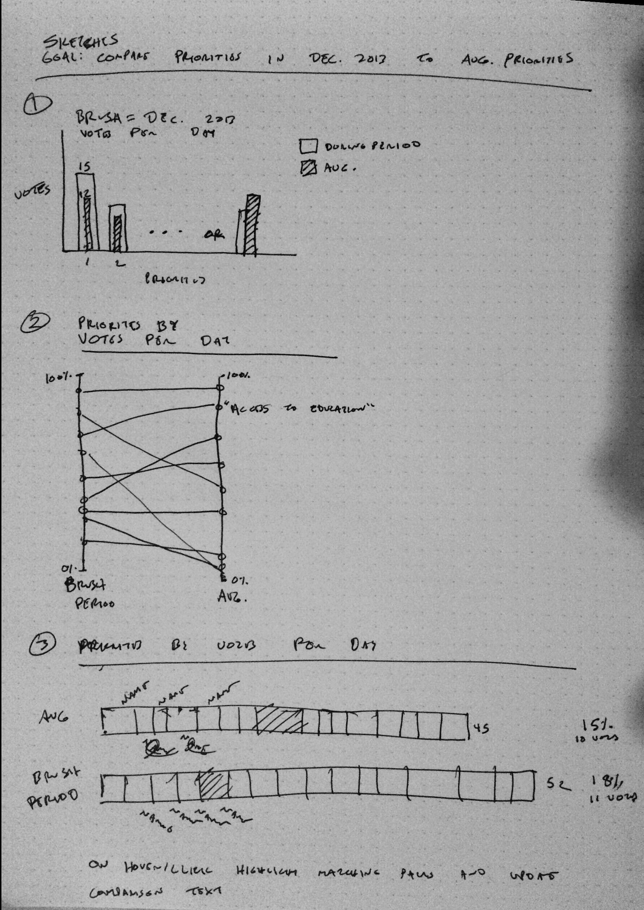
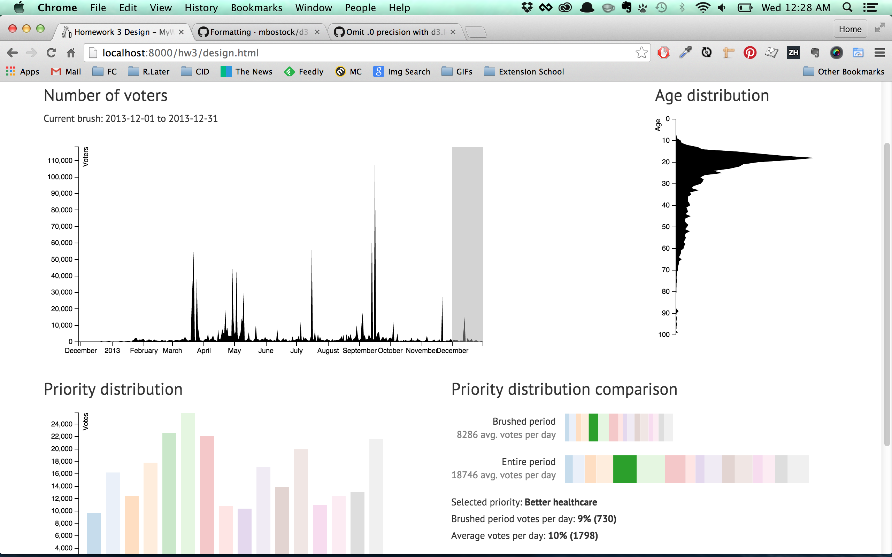

# Answers for Questions

Note: My design is in design.html.

### Q5a
**Question:** Choose __one__ comparison scenario and create at least three alternative designs that would allow this comparison.

-
**Answer:**

Comparison scenario: The head of outreach and public relations at the United Nations might be interested in seeing whether respondents priorities around the holidays in 2013 (generalized to the month of December) were different than the average.

### Q5b
**Question:** Implement one design in your visualization for **PrioVis** and explain why you have chosen this design.

-
**Answer:**

I chose to implement my second sketch, the stacked bar chart. The stacked bar shows composition while also allowing absolute comparison of average votes per day for the brushed period vs. the overall averages. My user will be able to select the range of 30 days for December and easily compare not only the average voting frequency, but also whether priorities shifted due to holiday values.

I discarded the bullet/paired bar approach because I'm skeptical of how accurately users perceive bullet charts and the paired bars don't show composition. The slopegraph was tempting, but the priority percentages would almost always hang out under 15%, which would be hard to pick out on a scale of 0 to 100% (which would be necessary for outliers), and you'd lose the absolute comparisons that one gets with the stacked bars.

Weaknesses of the approach as implemented: First is the sliding scale. It would be nice if the average total stayed the same no matter what and the only bar that changed length was the brushed period. But due to the presence of days with extremely high voting totals, a static domain was out of the question. Also, touch targets are too small for many of the bars, especially when it comes to the days with very few votes. A loupe could theoretically solve this, though I'm not sure how useful that affordance would be in practice.

With more time I would further link the segment highlighting to prioViz. I'd also improve the highlighting so that I wasn't relying on opacity, which dilutes the original color palette. And I'd make sure that the brushed bar started at 0 instead of the full range to indicate that the user hadn't brushed anything yet. Also, the total votes might make more sense at the end of the bars than under their labels on the left. As with all compositional charts, it's difficult to compare segments across wholes. I could have implemented lines connecting the segments or some sort of shift to the baseline on click to aid in that, but the explicit labeling of percentages and votes is the easiest solution to that problem.

All that being said, I think the design as implemented effectively solves the use case I outlined.

### Q5c
**Question:** As a very minimal case study submit a screenshot of an interesting pattern which you have found with your method and briefly describe the patteern.

-
Pattern: Turns our that priorities over the holidays (December 2013) didn't change much relative to the average. At most, there was a 1% difference.

